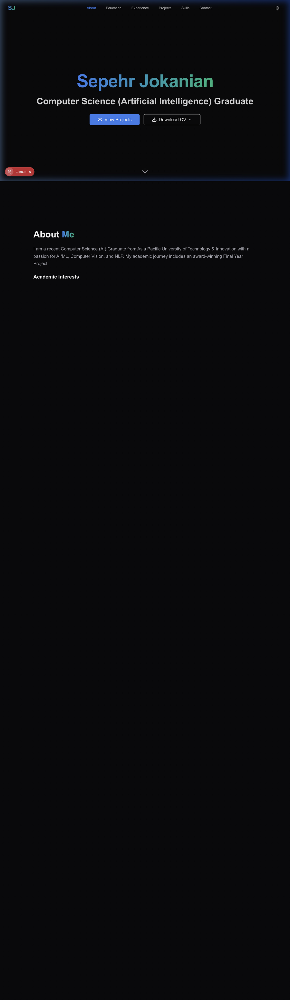

# Sepehr Jokanian — Portfolio

This repository contains my personal portfolio website, featuring a premium human-coded developer theme. It presents my academic background, projects, publications, and technical experience.

## Preview



## Run Locally

```bash
npm run dev
```

Open http://localhost:3000 in your browser.

## Project Structure

- `src/app` — Pages and layout
- `src/components` — UI components
- `src/lib/data.ts` — Main site content
- `public` — Images and CV files

## Customization

Edit the following file to update content:
`src/lib/data.ts`

## Build

```bash
npm run build
```
